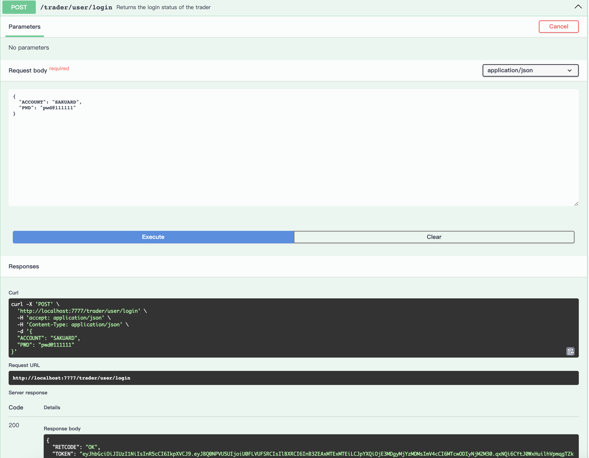
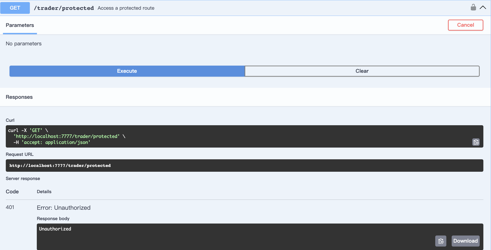
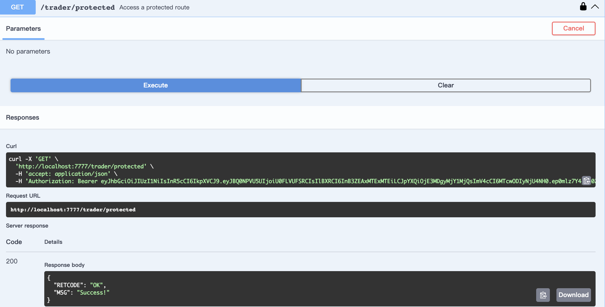
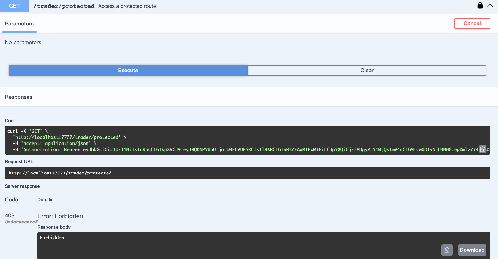

## Server
- ✅ **Swagger for API Document**
- ✅ **JWT Authentication**

### JWT Authentication Process

1. **Obtaining a JWT Token:**

   

2. **Access Denied Without JWT:**

   

3. **Access Granted With JWT:**

   

4. **Access Denied With Invalid JWT:**

   

